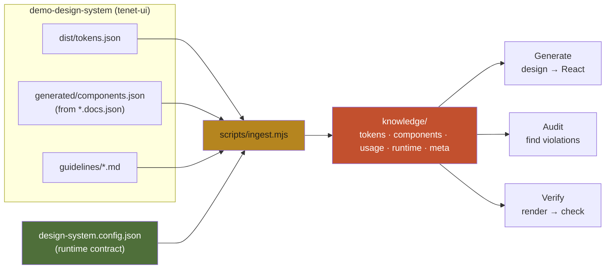
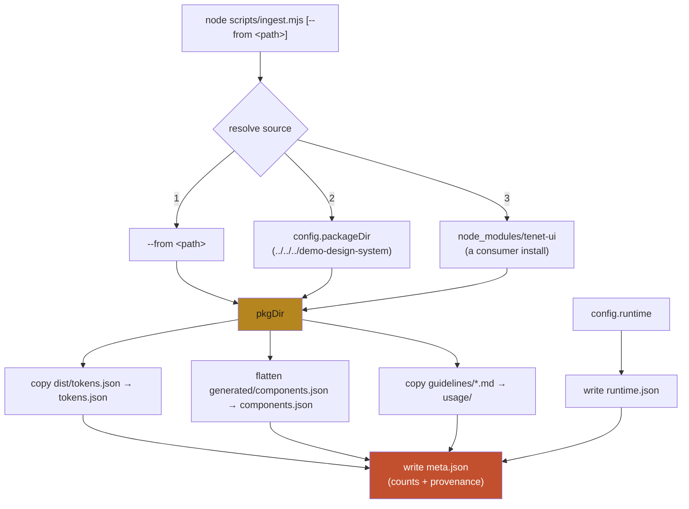
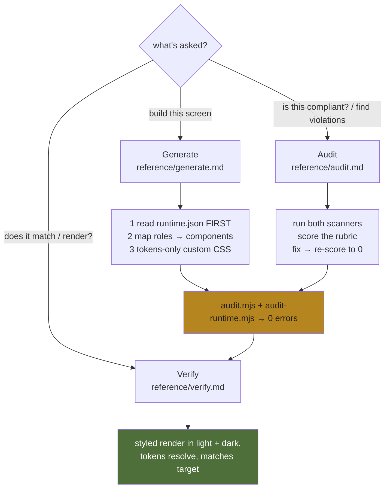
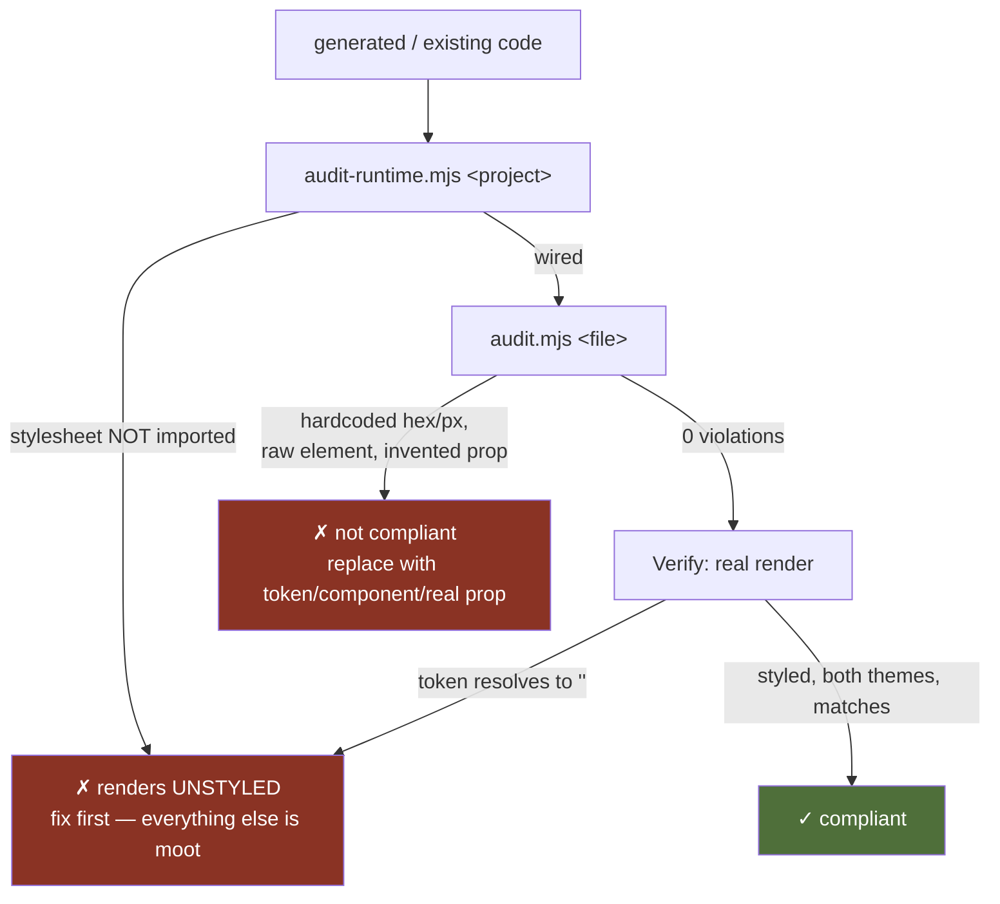
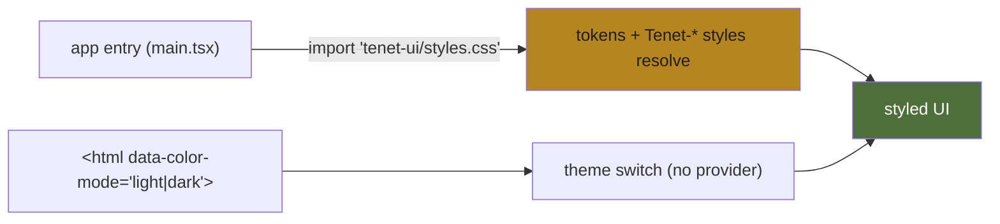

# Architecture — `tenet-ui-skill`

How this skill is built and how it works. It turns a design (screenshot, Figma
frame, or mockup) into **`tenet-ui`-compliant React**, audits existing code for
violations, and verifies that the result actually renders — grounded in an *ingested
snapshot* of the real `tenet-ui` API under `knowledge/`, not the model's training-data
memory.

- **Design system:** Tenet UI ("Editorial Ink"), npm package `tenet-ui`
- **Source package:** `demo-design-system/` (this monorepo)
- **Ingested knowledge:** 98 tokens · 36 components · 36 usage guidelines
- **Generated from:** `src/components/**/*.docs.json` (component catalog) + `dist/tokens.json`

## The one idea this skill exists to encode
A design system is a **runtime contract**, not just a token dictionary. Citing real
tokens/components is necessary but **not sufficient**: every `var(--token)` and every
`Tenet-*` component class is undefined until `tenet-ui/styles.css` is imported once at
the app root. Code can reference every token and component correctly and still render
**completely unstyled**. So the skill judges compliance on **two independent axes** —
*content* (are the right tokens/components used?) and *runtime* (do they resolve?) —
and gates on a real render (Verify).

## Directory layout
```
tenet-ui-skill/
├── SKILL.md                     # when-to-use + rubric + workflow pointers (progressive disclosure)
├── ARCHITECTURE.md              # this file
├── design-system.config.json    # single source of truth: sources + runtime contract
├── scripts/
│   ├── ingest.mjs               # DS package → knowledge/ snapshot
│   ├── audit.mjs                # per-file CONTENT audit (tokens/components/API)
│   └── audit-runtime.mjs        # per-project RUNTIME audit (does the DS resolve?)
├── reference/
│   ├── generate.md              # design → tenet-ui React
│   ├── verify.md                # prove it renders (the gate)
│   └── audit.md                 # find & fix violations
└── knowledge/                   # the ingested snapshot the model reads on demand
    ├── tokens.json              # 98 tokens (themed light/dark or shared value)
    ├── components.json          # 36 components (props, subcomponents, importPath)
    ├── runtime.json             # the runtime contract
    ├── meta.json                # counts + provenance
    └── usage/*.md               # 36 per-component guideline docs
```

## Data flow (build time → use time)


## Ingest pipeline (`scripts/ingest.mjs`)
Ingest is a dependency-free Node script that copies the *current* API into a committed
snapshot. It resolves the source package in priority order so it works whether the
skill lives next to the repo or is installed globally and pointed at a consumer:



Notes:
- **Tokens** are copied as-is. Themed entries carry `light` + `dark`; shared entries
  (spacing, radius, sizes) carry a single `value`.
  ```jsonc
  // themed
  "fgColor-default": { "name": "fgColor-default", "cssVar": "--fgColor-default",
                       "type": "color", "themed": true, "light": "#2a241b", "dark": "#f4eee3" }
  // shared
  "base-color-white": { "name": "base-color-white", "cssVar": "--base-color-white",
                        "value": "#ffffff", "type": "color" }
  ```
- **Components** ship as `{ schemaVersion, generatedFrom, components: { <id>: {...} } }`;
  ingest flattens to the inner map so the audit can `Object.values()` it. Each entry:
  `{ id, name, status, a11yReviewed, importPath, source, props[], stories, subcomponents }`.
- **Guidelines** are copied verbatim (one markdown per component).
- **Runtime contract** is copied from `config.runtime` so the workflows/scanners read
  it from the knowledge base.

Re-run `node scripts/ingest.mjs` after rebuilding the package so the skill never drifts
from the real API. `knowledge/meta.json` records counts + `generatedFrom` provenance.

## The three workflows
`SKILL.md` routes to one of three reference docs; all read the same `knowledge/`.



## The compliance rubric & the two-axis gate
The rubric (in `SKILL.md`), in order: **runtime wiring → components → color →
spacing/size → typography/radius/border/shadow → API → guidelines**. Two scanners
enforce it, and neither replaces a real render:



Why both axes exist (the canonical lesson):
- A **hardcoded-palette** reimplementation *looks* perfect but can't theme and fails
  the **content** audit — passes runtime, fails content.
- **Token-perfect code that never imports the stylesheet** audits clean but renders
  blank — passes content, fails **runtime**.

Only running both scanners **and** gating on Verify catches both.

### `scripts/audit.mjs` (content, per file)
Heuristic, dependency-free scanner over one `.tsx`. Builds indexes from `knowledge/`
(hex→token, px→token, valid css vars, component names, per-component prop sets incl.
compound subcomponents) and flags:
- hardcoded colors (`#hex`, `rgb()/hsl()`), off-scale px (the 4px scale; 1/2px allowed),
- unknown `var(--…)` tokens,
- raw `<button>/<input>/<textarea>/<select>/<a>` that have a `tenet-ui` equivalent,
- invented props on `tenet-ui` components (and subcomponents like `Tabs.Tab`).

Each finding carries the concrete fix (the token/component to use). Exits non-zero on
any error; `--json` for aggregation.

### `scripts/audit-runtime.mjs` (runtime, per project)
Walks the project, strips comments (so an import that lives only in a comment doesn't
count), detects whether the project uses `tenet-ui` (a `var(--…)`, an import from
`tenet-ui`, or a `Tenet-*` class), and if so requires the `runtime.json` `cssImports`
(and any `providers`) to actually be imported/mounted. This is the gate for the #1
failure mode.

## The runtime contract (`knowledge/runtime.json`)
`tenet-ui` ships tokens **and** component styles as one stylesheet. There is **no
provider** — theming is an attribute.



- `cssImports`: `["tenet-ui/styles.css"]`
- `classPrefix`: `Tenet-`
- `providers`: `[]` (none)
- `themeAttribute`: `data-color-mode` = `light | dark` on the documentElement
- `verifyTokensResolve`: `--bgColor-default`, `--fgColor-default`, `--borderColor-default`,
  `--fontFamily-body`, `--space-3` — Verify checks these are non-empty via `getComputedStyle`.

## How it was built
1. **Config.** `design-system.config.json` points at the repo build
   (`packageDir: ../../../demo-design-system`) and encodes the runtime contract.
2. **Ingest.** `node scripts/ingest.mjs` pulled 98 tokens, 36 components, and 36
   guideline docs into `knowledge/`.
3. **Scanners + workflows.** `audit.mjs` / `audit-runtime.mjs` enforce the rubric;
   `reference/{generate,verify,audit}.md` carry the three workflows.
4. **Verify harness.** `demo-app/` (Vite, port 5180) imports `tenet-ui/styles.css` once
   and aliases `tenet-ui` to the local source for fast iteration.

## Keeping it current
`tenet-ui` changes → `node scripts/ingest.mjs` re-ingests → commit `knowledge/`. The
update is a versioned commit, not an ops task on a drifting server. If a source path
moves, update `design-system.config.json`; `knowledge/meta.json` records provenance so
drift is easy to spot.

## Retargeting to another design system
This skill was hand-built for `tenet-ui`. To generate the same shape for *any* design
system (with the icons axis added), see the sibling **`create-design-system-skill`**
meta-skill, which interviews for sources (components, guidelines, Storybook, icons) and
produces a skill with this exact architecture.
